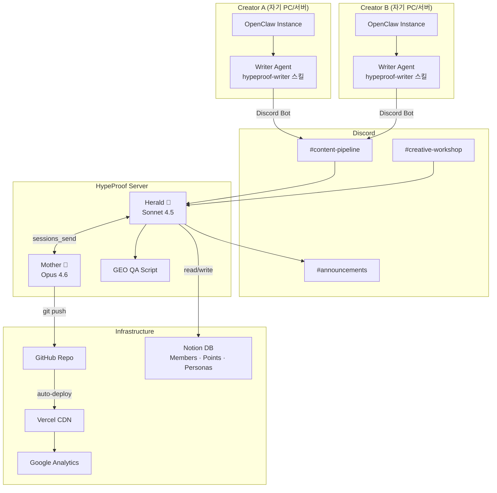
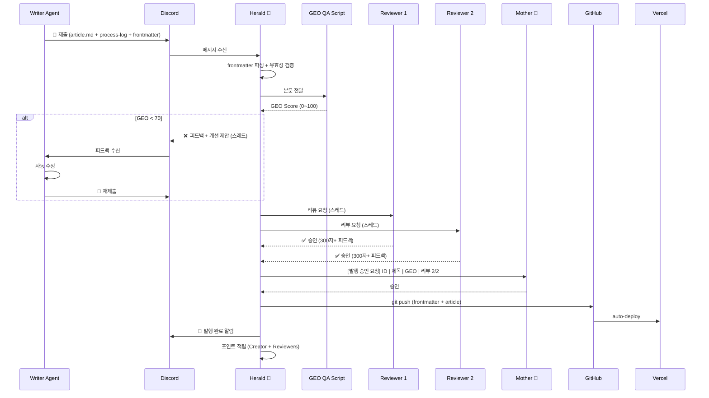
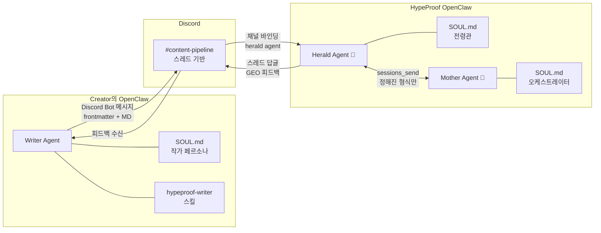

# HypeProof Lab — System Architecture

> 전체 시스템 아키텍처 개요 + 다이어그램
> Version: 1.0 | Created: 2026-02-14

---

## 1. System Overview

탈중앙 구조: 각 Creator가 자신의 OpenClaw 인스턴스에서 작가 에이전트를 운영하고, Discord를 통해 Herald에게 콘텐츠를 제출한다.



---

## 2. Content Submission Flow



---

## 3. Agent Communication



### 통신 프로토콜

| 경로 | 방식 | 형식 |
|------|------|------|
| Writer → Herald | Discord 메시지 (파일 첨부) | `SUBMIT:` prefix + frontmatter JSON + MD 파일 |
| Herald → Writer | Discord 스레드 답글 | GEO breakdown + 개선 제안 |
| Herald → Mother | `sessions_send` | `[발행 승인 요청]` / `[에스컬레이션]` / `[상태 보고]` |
| Mother → Herald | `sessions_send` | `[승인]` / `[거부]` / `[지시]` |

---

## 4. Points Economy

```mermaid
flowchart TD
    subgraph "적립 (Earn)"
        PUB[글 발행<br/>100 + (GEO-70)×3]
        CRE[창작물 발행<br/>100 + (일관성-70)×2]
        REV[Peer Review<br/>30P / 300자+]
        IMP[Impact 보너스<br/>30일 후 변동]
        REF[Referral<br/>50P]
    end

    subgraph "Notion DB"
        LEDGER[(Points Ledger)]
    end

    subgraph "사용 (Spend)"
        CCM[Claude Code Max<br/>2,200P / 월]
        PREM[프리미엄 AI 인프라<br/>TBD]
    end

    PUB --> LEDGER
    CRE --> LEDGER
    REV --> LEDGER
    IMP --> LEDGER
    REF --> LEDGER
    LEDGER --> CCM
    LEDGER --> PREM

    subgraph "Anti-Gaming"
        AG1[1인 1표]
        AG2[자기 글 투표 불가]
        AG3[GEO 70+ 필수]
        AG4[월 8편 상한]
        AG5[리뷰 없이 발행 불가]
        AG6[연속 리뷰어 금지]
    end

    AG1 -.-> LEDGER
    AG2 -.-> LEDGER
    AG3 -.-> LEDGER
```

---

## 5. Onboarding Flow

```mermaid
flowchart TD
    START([새 Creator 후보]) --> REC[기존 Creator가 추천]
    REC --> SAMPLE[포트폴리오/샘플 1건 제출]
    SAMPLE --> HERALD_V[Herald 🔔 접수 + 기본 검증]
    HERALD_V --> ADMIN[Admin 최종 승인]
    ADMIN --> NOTION[Notion DB 멤버 등록]
    ADMIN --> DISCORD[Discord Creator 역할 부여]

    NOTION --> SETUP[Creator 환경 세팅]
    DISCORD --> SETUP

    subgraph "Creator 환경 세팅"
        INST_OC[OpenClaw 설치]
        INST_SK[hypeproof-writer 스킬 설치]
        CONF_BOT[Discord Bot 토큰 설정]
        INST_OC --> INST_SK --> CONF_BOT
    end

    SETUP --> FIRST[첫 제출 테스트]
    FIRST --> HERALD_FB[Herald 피드백 + GEO 채점]
    HERALD_FB --> ACTIVE([Active Creator 🎉])

    style START fill:#1a1a2e
    style ACTIVE fill:#16213e
```



---

## 6. Herald Decision Tree

```mermaid
flowchart TD
    MSG([메시지 수신]) --> IS_SUB{SUBMIT: prefix?}

    IS_SUB -->|Yes| PARSE[frontmatter 파싱]
    IS_SUB -->|No| IS_CMD{명령어?}

    PARSE --> VALID{유효한 frontmatter?}
    VALID -->|No| ERR_FM[❌ frontmatter 오류 안내<br/>누락 필드 목록]
    VALID -->|Yes| GEO_RUN[GEO QA 채점 실행]

    GEO_RUN --> GEO_CHK{Score ≥ 70?}
    GEO_CHK -->|No| FB[📋 구체적 피드백<br/>카테고리별 breakdown + 개선 제안]
    FB --> WAIT_RESUB([재제출 대기])

    GEO_CHK -->|Yes| FAST{Score ≥ 90?}
    FAST -->|Yes| REV1[리뷰어 1명 배정<br/>Fast-track]
    FAST -->|No| REV2[리뷰어 2명 배정]

    REV1 --> THREAD[스레드 생성 + 리뷰 요청]
    REV2 --> THREAD

    THREAD --> TIMER[48시간 타이머 시작]
    TIMER --> REV_DONE{리뷰 완료?}
    REV_DONE -->|시간 초과| REASSIGN[리뷰어 재배정]
    REASSIGN --> TIMER
    REV_DONE -->|Reject| FB_REV[피드백 전달 → 수정 요청]
    FB_REV --> WAIT_RESUB
    REV_DONE -->|2/2 Approve| MOTHER_REQ[Mother에게 승인 요청]

    MOTHER_REQ --> M_DEC{Mother 결정}
    M_DEC -->|승인| PUBLISH[git push + 포인트 적립 + 알림]
    M_DEC -->|거부| FB_M[사유 전달]

    IS_CMD -->|status| STATUS[제출물 상태 조회]
    IS_CMD -->|help| HELP[도움말 제공]
    IS_CMD -->|persona| PERSONA[페르소나 등록 플로우]
    IS_CMD -->|No| GENERAL[일반 대화 응답]

    style MSG fill:#2d1b69
    style PUBLISH fill:#1b4332
```



---

## 데이터 흐름 요약

| 데이터 | 저장소 | 접근 권한 |
|--------|--------|----------|
| 콘텐츠 (발행글, 소설) | GitHub → Vercel | Public (read), Creator (write) |
| 멤버 정보 (이메일, Discord ID) | Notion DB | Admin only |
| 포인트 원장 | Notion DB | Admin (write), Creator (read 본인만) |
| AI Persona 정의 | GitHub (YAML) + Notion (메타) | Creator (자기 것), Admin (전체) |
| 제출물 상태 | Herald Memory (submissions.json) | Herald (read/write) |
| GEO 채점 이력 | Herald Memory | Herald (read/write) |
| 리뷰 이력 | Herald Memory | Herald (read/write) |
| AI Referral 트래킹 | Google Analytics | Admin only |

---

## 보안 경계

```
┌─────────────────────────────────────────────────┐
│ Public Zone                                     │
│  Vercel (웹사이트)  ←  GitHub (콘텐츠)           │
│  Google Analytics                                │
├─────────────────────────────────────────────────┤
│ Creator Zone                                    │
│  Discord (#content-pipeline, #creative-workshop)│
│  각자의 OpenClaw + Writer Agent                  │
│  GitHub (push 권한)                              │
├─────────────────────────────────────────────────┤
│ Admin Zone                                      │
│  Notion DB (멤버, 포인트, 페르소나)              │
│  Mother Agent                                    │
│  Herald 설정                                     │
│  Google Analytics 대시보드                       │
└─────────────────────────────────────────────────┘
```

---

*이 문서는 SPEC.md와 연계됩니다. 다이어그램은 Mermaid 문법으로 GitHub/Notion에서 렌더링됩니다.*
