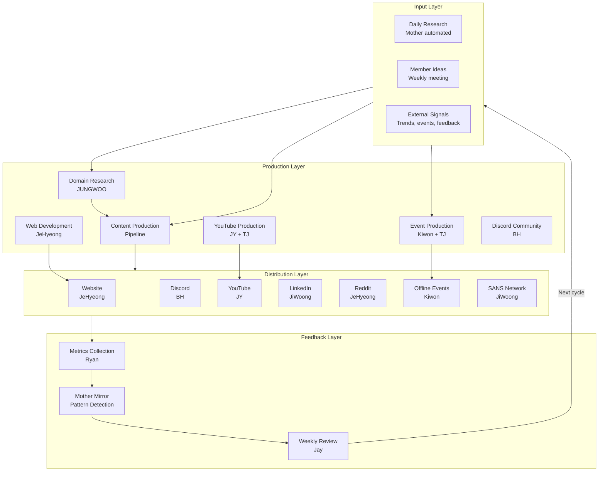
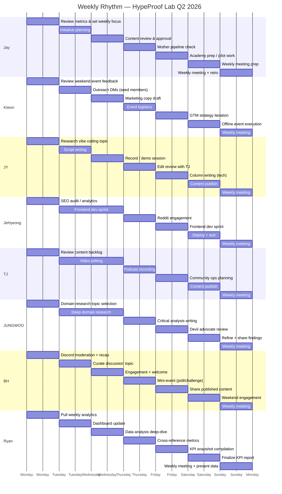
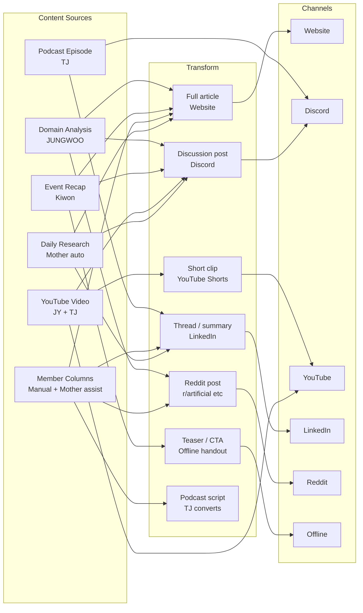
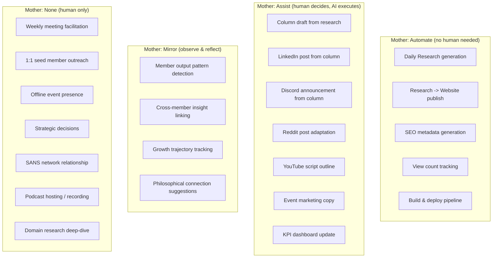
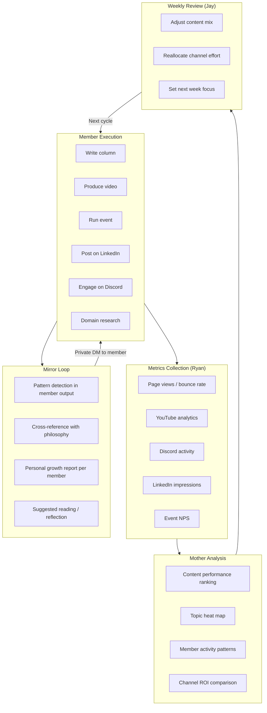

# HypeProof Lab — 2026 Q2 Operational Workflow

> **Version**: 2.0
> **Created**: 2026-03-23
> **Updated**: 2026-03-24
> **Scope**: April 1 - June 30, 2026
> **Purpose**: Every member reads their section and knows exactly what to do, every day.

---

## Table of Contents

1. [Member Domain Map](#1-member-domain-map)
2. [Weekly Rhythm](#2-weekly-rhythm)
3. [Content Production Pipeline](#3-content-production-pipeline)
4. [Channel Distribution Matrix](#4-channel-distribution-matrix)
5. [Mother AI Integration](#5-mother-ai-integration)
6. [Feedback Collection Loop](#6-feedback-collection-loop)
7. [Mother Mirror Loop](#7-mother-mirror-loop)
8. [Monthly Cadence](#8-monthly-cadence)
9. [Cross-Channel Amplification](#9-cross-channel-amplification)
10. [Content Routing by Type](#10-content-routing-by-type)
11. [Onboarding Pipeline](#11-onboarding-pipeline)
12. [Escalation & Decision Flow](#12-escalation--decision-flow)
13. [KPIs per Channel](#13-kpis-per-channel)
14. [First 4 Weeks Launch Plan](#14-first-4-weeks-launch-plan)
15. [Step Registry (Master List)](#15-step-registry)
16. [Next Iteration TODO](#16-next-iteration-todo)

---

## Diagrams

### D-1: Overall Workflow Overview



### D-2: Weekly Rhythm



### D-3: Content Flow Across Channels



### D-4: Mother AI Integration Points



### D-5: Feedback & Mirror Loop



### D-6: Content Routing Map

```mermaid
flowchart TB
    subgraph CONTENT["Content Types"]
        C1["Daily Research<br/>(Mother, 06:00 daily)"]
        C2["Column<br/>(member + Mother QA)"]
        C3["YouTube Episode<br/>(JY + TJ, weekly)"]
        C4["Podcast Episode<br/>(TJ, bi-weekly)"]
        C5["Event Recap<br/>(Kiwon, per event)"]
        C6["Domain Analysis<br/>(JUNGWOO, bi-weekly)"]
        C7["Discord Discussion<br/>(BH, daily)"]
    end

    subgraph WEBSITE["Website"]
        W1["Full article<br/>immediate"]
        W2["Full article<br/>same day"]
        W3["Embed + transcript<br/>+3 days"]
        W4["Summary article<br/>+2 days"]
        W5["Recap article<br/>+3 days"]
        W6["Full analysis<br/>same day"]
    end

    subgraph DISCORD["Discord"]
        D1["#daily-research<br/>within 1h"]
        D2["#content-pipeline<br/>same day"]
        D3["Watch party<br/>same day"]
        D4["Episode thread<br/>same day"]
        D5["Photos + highlights<br/>+1 day"]
        D6["Debate thread<br/>same day"]
    end

    subgraph LINKEDIN["LinkedIn"]
        L1["Summary adapt<br/>same day"]
        L2["Professional take<br/>+1 day"]
        L3["Key insight post<br/>+1 day"]
        L4["Guest highlight<br/>+1 day"]
        L5["Professional recap<br/>+2 days"]
        L6["Provocative take<br/>+2 days"]
    end

    subgraph REDDIT["Reddit"]
        R2["Community angle<br/>+1-2 days"]
        R6["Discussion post<br/>+2 days"]
    end

    subgraph OTHER["Other"]
        O3["YouTube Shorts<br/>+2-3 days"]
        O5a["SANS debrief<br/>+1 week"]
        O5b["Follow-up email<br/>+3 days"]
        O7["Podcast script<br/>bi-weekly"]
    end

    C1 --> W1
    C1 --> D1
    C1 --> L1

    C2 --> W2
    C2 --> D2
    C2 --> L2
    C2 --> R2
    C2 --> O7

    C3 --> W3
    C3 --> D3
    C3 --> L3
    C3 --> O3

    C4 --> W4
    C4 --> D4
    C4 --> L4

    C5 --> W5
    C5 --> D5
    C5 --> L5
    C5 --> O5a
    C5 --> O5b

    C6 --> W6
    C6 --> D6
    C6 --> L6
    C6 --> R6

    C7 --> O7
```



---

## 1. Member Domain Map

| Member | Primary Domain | Secondary Domain | Channels Owned | Weekly Hours (est.) |
|--------|---------------|-----------------|----------------|-------------------|
| **Jay** | Overall framework, Mother ops, Initiative Provider | Academy pilot, pipeline | All (oversight) | 15-20 |
| **Kiwon** | Offline events, Marketing (GTM, seed, FOMO) | Community growth strategy | Offline, Marketing | 8-10 |
| **JiWoong** | SANS network, LinkedIn, Strategy consulting | Two-track GTM analysis | LinkedIn, SANS | 5-8 |
| **JY** | YouTube, Vibe Coding series, Tech content | Academy tech support | YouTube, Tech columns | 8-10 |
| **TJ** | Video production, Podcast pipeline | Community ops design | YouTube (production), Podcast | 8-10 |
| **JeHyeong** | Website, SEO, Reddit, Frontend | Design renewal | Website, Reddit | 10-12 |
| **BH** | Discord community operations | Content curation | Discord | 5-8 |
| **JUNGWOO** | Domain-specific AI opportunity research | Critical review ("devil's advocate") on major decisions | Research (domain), Strategic feedback | 5-8 |
| **Ryan** | Data analysis, Performance tracking, KPI dashboard | Research methodology | Analytics, Dashboard | 5-8 |

---

## 2. Weekly Rhythm

### Sunday: Weekly Sync (All Members)

| Time | Activity | Who | Duration |
|------|----------|-----|----------|
| 21:00 | Weekly meeting opens | Jay (host) | 5 min |
| 21:05 | Each member: 2-min update (what I did, what blocked me) | All | 20 min |
| 21:25 | Ryan: KPI dashboard review | Ryan | 10 min |
| 21:35 | JUNGWOO: domain research finding of the week (2-min) | JUNGWOO | 5 min |
| 21:40 | Jay: Next week focus + assignments | Jay | 10 min |
| 21:50 | Open discussion | All | 10 min |
| 22:00 | Meeting ends | - | - |

### Monday: Plan & Review

| Time | Member | Action | Output |
|------|--------|--------|--------|
| 08:00 | Mother | Publish Daily Research (auto, cron) | Research page live on website |
| 09:00 | Jay | Review last week metrics (Mother dashboard), set weekly theme | Weekly focus memo in #daily-research |
| 09:00 | Ryan | Pull weekly analytics snapshot | Raw data into tracking sheet |
| 09:30 | JY | Research next Vibe Coding episode topic from daily research | Topic brief (1-pager) |
| 10:00 | JeHyeong | SEO audit (Search Console data), plan dev sprint | Sprint items (3-5 tasks) |
| 10:00 | JUNGWOO | Identify domain research topic for the week; scan daily research for domain-AI opportunities | Research question posted in #daily-research |
| 12:00 | Kiwon | Review weekend event feedback, plan outreach targets | Outreach target list (5-10 names) |
| 14:00 | JiWoong | LinkedIn content calendar check, SANS contact review | Week's LinkedIn post topics (2-3) |
| 14:00 | TJ | Review content backlog, prioritize editing queue | Editing priority list |
| 19:00 | BH | Review Discord weekend activity, moderate, post weekly recap | Activity summary post in #content-pipeline |

### Tuesday: Create

| Time | Member | Action | Output |
|------|--------|--------|--------|
| 08:00 | Mother | Publish Daily Research (auto) | Research page live |
| 09:00 | Jay | Mother pipeline maintenance, Academy curriculum work | Pipeline health report |
| 09:00 | JY | Write YouTube script / Vibe Coding episode outline | Script draft |
| 09:30 | JUNGWOO | Deep research on weekly domain topic (industry reports, market data, expert interviews) | Research notes (structured, 3-5 pages) |
| 10:00 | JeHyeong | Frontend development sprint | Code commits |
| 10:00 | Ryan | Build/update KPI dashboard component | Dashboard update |
| 12:00 | Kiwon | Send outreach DMs to seed member candidates | 5-10 personalized DMs sent |
| 14:00 | JiWoong | Write LinkedIn post #1 (from research or column) | LinkedIn post draft |
| 14:00 | TJ | Video editing session (current project) | Edited segment |
| 19:00 | BH | Curate and post discussion topic in Discord | 1 discussion thread |

### Wednesday: Produce

| Time | Member | Action | Output |
|------|--------|--------|--------|
| 08:00 | Mother | Publish Daily Research (auto) | Research page live |
| 09:00 | Jay | Review and approve queued content (columns, posts) | Approved content queue |
| 09:00 | JY | Record / demo session for Vibe Coding | Raw recording |
| 10:00 | JeHyeong | Frontend sprint continues, Reddit engagement (1 post) | Code + Reddit post |
| 10:00 | JUNGWOO | Write critical analysis memo on weekly domain topic | Analysis memo (internal, 2-page brief) |
| 12:00 | Kiwon | Draft marketing copy (event promo, social posts) | Marketing copy for review |
| 14:00 | JiWoong | Publish LinkedIn post #1, engage with comments | Published post |
| 14:00 | TJ | Continue video editing / podcast prep | Near-final cut |
| 19:00 | BH | Discord engagement: respond to threads, welcome new members | Active moderation |
| 20:00 | Ryan | Data analysis on specific metric deep-dive | Analysis report |

### Thursday: Polish & Collaborate

| Time | Member | Action | Output |
|------|--------|--------|--------|
| 08:00 | Mother | Publish Daily Research (auto) | Research page live |
| 09:00 | Jay | Academy pilot logistics (if upcoming), Mother Mirror review | Logistics checklist |
| 09:00 | JY | Review edit with TJ, iterate on video | Revised cut |
| 10:00 | JeHyeong | SEO optimization pass on new content | SEO-optimized pages |
| 10:00 | JUNGWOO | Review all major proposals/decisions made this week; write devil's advocate feedback (risks, blind spots, counter-arguments) | Critical feedback memo posted in #content-pipeline |
| 12:00 | Kiwon | Event logistics coordination (venue, materials, comms) | Event checklist updated |
| 14:00 | JiWoong | Write LinkedIn post #2, SANS network touchpoint | LinkedIn post + 1 SANS interaction |
| 14:00 | TJ | Finalize video edit, podcast recording session | Final cut / podcast raw audio |
| 19:00 | BH | Discord: run mini-event (poll, challenge, or AMA topic) | Engagement event |
| 20:00 | Ryan | Cross-reference metrics with content topics | Correlation report |

### Friday: Publish & Distribute

| Time | Member | Action | Output |
|------|--------|--------|--------|
| 08:00 | Mother | Publish Daily Research (auto) | Research page live |
| 09:00 | Jay | Final content approval, Mother deploy trigger | Published content |
| 09:30 | JUNGWOO | Refine domain research into a publishable column pitch or domain brief | Column pitch or 2-page domain brief |
| 10:00 | JeHyeong | Deploy website updates, test live | Deployed + verified |
| 12:00 | Kiwon | Send event reminders, follow up on outreach responses | Outreach status update |
| 14:00 | JiWoong | Publish LinkedIn post #2, respond to week's engagement | Published post |
| 14:00 | JY | Column writing (tech perspective) | Column draft for review |
| 14:00 | TJ | Publish video / podcast episode | Published media |
| 19:00 | BH | Discord: share published content, facilitate discussion | Content distribution |
| 20:00 | Ryan | Weekly KPI snapshot compilation | KPI report draft |

### Saturday: Flex & Events

| Time | Member | Action | Output |
|------|--------|--------|--------|
| 10:00 | Jay | Personal study (philosophy, pedagogy), week reflection | Study notes |
| 10:00 | Kiwon | Offline event execution (when scheduled) | Event execution |
| 10:00 | JUNGWOO | Free research / reading; prepare domain findings for Sunday presentation | Presentation notes |
| 12:00 | JY | Publish content (column or video), community engagement | Published content |
| 12:00 | JeHyeong | Deploy pending changes, weekend SEO check | Deployed updates |
| 14:00 | JiWoong | Network maintenance, async LinkedIn engagement | Relationship log |
| 14:00 | TJ | Content polish, community ops iteration | Polished assets |
| 19:00 | BH | Discord: weekend engagement, casual discussion facilitation | Active community |
| 20:00 | Ryan | Finalize weekly KPI report for Sunday meeting | KPI report final |

---

## 3. Content Production Pipeline

### Phase 1: Research & Ideation (S-001 to S-020)

| Step | Phase | Owner | Input | Action | Output | AI Role | Frequency |
|------|-------|-------|-------|--------|--------|---------|-----------|
| S-001 | Research | Mother | RSS feeds, API sources | Automated daily research crawl and synthesis | Raw research document (KO/EN) | Automate | Daily |
| S-002 | Research | Mother | Raw research | Format and publish to website | Published research page | Automate | Daily |
| S-003 | Research | Mother | Published research | Post summary to Discord #daily-research | Discord message | Automate | Daily |
| S-004 | Research | Jay | Weekly research archive | Review top-performing research topics | Topic heat map | Assist | Weekly |
| S-005 | Ideation | Jay | Topic heat map + member inputs | Select 2-3 column topics for the week | Column topic list | None | Weekly (Mon) |
| S-006 | Ideation | JY | AI/tech trends, Vibe Coding backlog | Propose YouTube episode topic | Topic brief | None | Weekly (Mon) |
| S-007 | Ideation | JUNGWOO | Industry trends, domain signals | Propose domain-critical research question | Research question | None | Weekly (Mon) |
| S-008 | Ideation | Kiwon | Marketing trends, competitor activity | Propose marketing-angle column topic | Topic suggestion | None | Bi-weekly |
| S-009 | Ideation | JiWoong | SANS network conversations, LinkedIn trends | Surface strategic insights for content | Strategic insight memo | None | Weekly |
| S-010 | Ideation | TJ | Community feedback, podcast listener questions | Propose podcast/video topic | Topic suggestion | None | Weekly |
| S-011 | Ideation | Ryan | Data analysis results, metric anomalies | Propose data-driven content angle | Data insight | Assist | Weekly |
| S-012 | Ideation | BH | Discord conversations, member questions | Surface community-driven content needs | Community pulse report | None | Weekly |
| S-013 | Research | JUNGWOO | Selected research question | Deep-dive domain research | Research notes (2-3 pages) | None | Weekly |
| S-014 | Research | Ryan | Selected metric or dataset | Quantitative analysis for content backing | Data analysis report | Assist | Weekly |
| S-015 | Curation | Jay | All topic proposals (S-005 to S-012) | Prioritize and assign topics to writers | Assigned topic list | None | Weekly (Mon) |
| S-016 | Research | Mother | Assigned column topic | Pull related research, prior columns, external refs | Research package per topic | Automate | Per topic |
| S-017 | Research | Mother | Member's past 3 columns | Pre-writing reading suggestions (philosophy, theory) | Reading list (2-3 links) | Mirror | Per column |
| S-018 | Research | JY | Vibe Coding topic brief | Technical research, demo preparation | Demo environment ready | None | Weekly |
| S-019 | Research | TJ | Podcast topic | Guest research, question preparation | Interview prep doc | None | Per episode |
| S-020 | Research | JeHyeong | SEO audit results | Identify content gaps for SEO targeting | SEO content gap report | Assist | Weekly |

### Phase 2: Draft & Create (S-021 to S-040)

| Step | Phase | Owner | Input | Action | Output | AI Role | Frequency |
|------|-------|-------|-------|--------|--------|---------|-----------|
| S-021 | Draft | Column author | Research package (S-016) | Write column draft (KO) | Column draft KO (markdown) | Assist | Per column |
| S-022 | Draft | Mother | Column draft KO | Generate EN translation | Column draft EN (markdown) | Automate | Per column |
| S-023 | Draft | JY | Script draft | Record Vibe Coding demo video | Raw video footage | None | Weekly |
| S-024 | Draft | TJ | Interview prep | Record podcast episode | Raw audio | None | Bi-weekly |
| S-025 | Draft | TJ | Raw video from JY | Edit video: cuts, overlays, intro/outro | Edited video | None | Weekly |
| S-026 | Draft | TJ | Raw podcast audio | Edit podcast: levels, intro/outro, chapters | Edited podcast | None | Bi-weekly |
| S-027 | Draft | Kiwon | Event plan | Create event marketing materials | Flyer, social posts, email draft | Assist | Per event |
| S-028 | Draft | JeHyeong | Design specs | Create/update website components | Frontend code | None | Weekly |
| S-029 | Draft | BH | Discussion topic | Create Discord engagement content (polls, challenges) | Engagement content | None | 2x/week |
| S-030 | Draft | JiWoong | Column or research output | Adapt content for LinkedIn post | LinkedIn post draft | Assist | 2x/week |
| S-031 | Draft | JeHyeong | Column or research output | Adapt content for Reddit post | Reddit post draft | Assist | 1-2x/week |
| S-032 | Draft | Mother | Published video | Generate YouTube description, tags, chapters | Video metadata | Automate | Per video |
| S-033 | Draft | Mother | Column content | Generate social media snippets (3 variations) | Social snippets | Assist | Per column |
| S-034 | Draft | Ryan | Analysis results | Create data visualization for content | Charts / infographics | Assist | Per analysis |
| S-035 | Draft | JUNGWOO | Research notes | Write critical analysis column draft | Column draft | None | Bi-weekly |
| S-036 | Draft | Mother | Event recap notes (Kiwon) | Generate event summary article | Event recap draft | Assist | Per event |
| S-037 | Draft | JY | Column topic (tech) | Write tech-angle column draft | Column draft | Assist | Weekly |
| S-038 | Draft | Mother | YouTube video | Generate short-form clip suggestions (timestamps) | Clip list with timestamps | Assist | Per video |
| S-039 | Draft | TJ | Clip list | Cut YouTube Shorts from long-form video | Short-form videos (3-5) | None | Per video |
| S-040 | Draft | Jay | Initiative idea | Write initiative brief for team | Initiative doc | None | As needed |

### Phase 3: QA & Review (S-041 to S-055)

| Step | Phase | Owner | Input | Action | Output | AI Role | Frequency |
|------|-------|-------|-------|--------|--------|---------|-----------|
| S-041 | QA | Mother | Column draft (KO + EN) | Automated QA: frontmatter, slug, formatting, links | QA report (pass/fail + issues) | Automate | Per column |
| S-042 | QA | Mother | Column draft | Check against CLAUDE.md rules (slug=filename, required fields) | Compliance report | Automate | Per column |
| S-043 | QA | Jay | Column draft + QA report | Editorial review: tone, accuracy, depth | Approved or revision request | None | Per column |
| S-044 | QA | Mother | Website code changes | Run `npm run build` and report result | Build pass/fail | Automate | Per deploy |
| S-045 | QA | JeHyeong | Build result | If build fails, diagnose and fix | Fixed code | None | Per failure |
| S-046 | QA | Mother | Video metadata | Verify description, tags, chapter markers | Metadata QA report | Automate | Per video |
| S-047 | QA | TJ | Edited video | Final review: audio levels, visual quality, branding | Approved video | None | Per video |
| S-048 | QA | Kiwon | Marketing copy | Review for GTM alignment, FOMO effectiveness | Approved marketing copy | None | Per piece |
| S-049 | QA | JiWoong | LinkedIn post draft | Review for professional tone, strategic framing | Approved post | None | Per post |
| S-050 | QA | Mother | Column content | Cross-check with PHILOSOPHY.md (no fear-based marketing, etc.) | Philosophy compliance check | Automate | Per column |
| S-051 | QA | Ryan | Data-backed content | Verify data accuracy, methodology | Data QA sign-off | None | Per analysis |
| S-052 | QA | JUNGWOO | Critical analysis draft | Self-review for constructive tone (not destructive) | Reviewed draft | None | Per piece |
| S-053 | QA | Mother | EN translation | Back-translate check: does EN preserve KO meaning? | Translation QA | Assist | Per column |
| S-054 | QA | JeHyeong | Reddit post draft | Check subreddit rules, tone adaptation | Approved Reddit post | None | Per post |
| S-055 | QA | Jay | All queued content for the week | Final batch approval before publish | Publish queue confirmed | None | Weekly (Fri) |

### Phase 4: Publish & Deploy (S-056 to S-070)

| Step | Phase | Owner | Input | Action | Output | AI Role | Frequency |
|------|-------|-------|-------|--------|--------|---------|-----------|
| S-056 | Publish | Mother | Approved column (KO + EN) | Write files to `web/src/content/columns/{ko,en}/` | Content files committed | Automate | Per column |
| S-057 | Publish | Mother | Content files | Run `npm run build` (clean: `rm -rf .next` first) | Successful build | Automate | Per deploy |
| S-058 | Publish | Mother | Successful build | Run `cd web && vercel --prod --yes` | Live deployment | Automate | Per deploy |
| S-059 | Publish | Mother | Live deployment | Verify live URL returns 200, content renders | Deployment verification | Automate | Per deploy |
| S-060 | Publish | TJ | Approved video | Upload to YouTube with metadata | Published YouTube video | None | Per video |
| S-061 | Publish | TJ | Approved podcast | Upload to podcast platform | Published podcast episode | None | Per episode |
| S-062 | Publish | JiWoong | Approved LinkedIn post | Post to LinkedIn | Published LinkedIn post | None | 2x/week |
| S-063 | Publish | JeHyeong | Approved Reddit post | Post to target subreddits | Published Reddit post | None | 1-2x/week |
| S-064 | Publish | BH | Published content (any channel) | Share in Discord #daily-research with discussion prompt | Discord distribution | None | Per publish |
| S-065 | Publish | Mother | Published column | Generate Discord announcement text | Announcement draft | Assist | Per column |
| S-066 | Publish | TJ | Short-form clips | Upload YouTube Shorts | Published Shorts | None | Per batch |
| S-067 | Publish | Kiwon | Approved marketing materials | Distribute via targeted channels (DM, groups) | Marketing distributed | None | Per event |
| S-068 | Publish | Mother | All published content | Update internal content index/manifest | Content manifest | Automate | Per publish |
| S-069 | Publish | JeHyeong | Deployed website | Post-deploy SEO check (sitemap, meta tags, indexing) | SEO health report | Assist | Per deploy |
| S-070 | Publish | Ryan | Published content metadata | Log publish event in tracking system | Tracking entry | Assist | Per publish |

---

## 4. Channel Distribution Matrix

| Content Type | Website | Discord | YouTube | LinkedIn | Reddit | Offline | SANS |
|-------------|---------|---------|---------|----------|--------|---------|------|
| Daily Research | Full article | Summary + link | - | Excerpt (1x/week) | - | - | - |
| Column (KO/EN) | Full article | Announcement + discussion | - | Adapted post | Adapted post | Printout at events | Share link |
| Vibe Coding Video | Embed/link | Announcement + discussion | Full video + Shorts | Teaser clip/post | Post in r/vibe_coding | Demo at events | - |
| Podcast | Embed/link | Episode discussion thread | Full audio | Episode highlight post | - | - | Share link |
| Event Recap | Full article | Photo + summary | Highlight reel | Professional recap | - | Follow-up email | Debrief |
| Data Analysis | Infographic page | Discussion | - | Key finding post | Data post | Slide in deck | Insight share |
| Domain Analysis | Full article | Debate thread | - | Provocative take | Discussion post | - | - |

**Channel Owners:**

| Channel | Primary Owner | Backup | Publish Cadence |
|---------|-------------|--------|-----------------|
| Website | JeHyeong | Jay (Mother deploy) | Daily (research), 2-3x/week (columns) |
| Discord | BH | Jay | Daily |
| YouTube | JY (content) + TJ (production) | - | 1x/week (long), 3x/week (shorts) |
| LinkedIn | JiWoong | Kiwon | 2x/week |
| Reddit | JeHyeong | JY | 1-2x/week |
| Offline Events | Kiwon | TJ | 1-2x/month |
| SANS Network | JiWoong | Jay | Ongoing (relationship) |

---

## 5. Mother AI Integration

### 5.1 Automate (Mother runs independently)

| Step | What Mother Does | Trigger | Agent | Command | Success Criteria | On Failure |
|------|-----------------|---------|-------|---------|-----------------|------------|
| S-001 | Daily research crawl + synthesis | Cron (daily 06:00 KST) | `research-analyst` | `/research` | KO+EN markdown files created in `research/daily/` | Retry 1x after 10 min; if fail, alert Jay via Discord DM |
| S-002 | Publish research to website | Research complete (S-001) | `web-developer` | `/deploy` | Live URL returns 200, content renders | Block publish, alert JeHyeong + Jay |
| S-003 | Post to Discord #daily-research | Publish complete (S-002) | `community-manager` | `/announce <slug>` | Discord message posted with summary + link | Log error, Jay manually posts |
| S-016 | Pull research package for assigned topic | Topic assigned (S-015) | `research-analyst` | `/research --topic <X>` | Research package markdown with 5+ sources | Retry 1x; if fail, author does manual research |
| S-041 | QA check on column drafts | Draft submitted | `qa-reviewer` | `/qa-check <file> --type column` | QA report JSON with pass/fail + issues list | Author reviews draft manually, Jay notified |
| S-042 | CLAUDE.md compliance check | Draft submitted | `qa-reviewer` | `/qa-check <file>` | Compliance report: all required fields present, slug matches filename | Author fixes manually |
| S-044 | Build verification | Code committed | `web-developer` | `/deploy --clean` | `npm run build` exits 0, no TypeScript errors | Block deploy, alert JeHyeong via #content-pipeline |
| S-057 | Clean build for deploy | Deploy triggered | `web-developer` | `/deploy --clean` | `rm -rf .next && npm run build` exits 0 | Block deploy, alert Jay + JeHyeong |
| S-058 | Vercel deployment | Build passes (S-057) | `web-developer` | `cd web && vercel --prod --yes` | Vercel returns deployment URL | Retry 1x; if fail, Jay manually deploys |
| S-059 | Live URL verification | Deploy complete (S-058) | `web-developer` | HTTP GET to deployment URL | 200 status, content renders correctly | Alert Jay, rollback if possible |
| S-068 | Content manifest update | Any publish | `publish-orchestrator` | (internal step) | Manifest JSON updated with new entry | Log warning, manual update next cycle |

### 5.2 Assist (Human triggers, Mother executes)

| Step | What Mother Does | Triggered By | Agent | Command | Human Decision |
|------|-----------------|-------------|-------|---------|----------------|
| S-022 | Translate column KO to EN | Author submits KO draft | `content-columnist` | `/write-column <topic> --translate` | Author reviews translation |
| S-030 | Draft LinkedIn post from column | Author requests adaptation | `content-columnist` | `/write-column <topic> --format linkedin` | JiWoong edits and approves |
| S-031 | Draft Reddit post from column | Author requests adaptation | `content-columnist` | `/write-column <topic> --format reddit` | JeHyeong edits and approves |
| S-032 | Generate YouTube metadata | TJ requests after upload | `community-manager` | `/announce <slug> --format youtube` | TJ reviews |
| S-033 | Generate social snippets | Author requests | `community-manager` | `/announce <slug> --snippets` | Author selects best |
| S-036 | Generate event recap draft | Kiwon submits notes | `content-columnist` | `/write-column <topic> --type recap` | Kiwon edits |
| S-038 | Suggest short-form clips | TJ requests | `content-columnist` | (manual prompt) | TJ selects |
| S-050 | Philosophy compliance check | Draft submitted | `qa-reviewer` | `/qa-check <file> --philosophy` | Author resolves |
| S-053 | Translation QA | EN draft ready | `qa-reviewer` | `/qa-check <file> --translation` | Author reviews |
| S-065 | Discord announcement draft | Column published | `community-manager` | `/announce <slug>` | BH reviews and posts |
| S-069 | SEO health report | Deploy complete | `web-developer` | (post-deploy check) | JeHyeong acts on findings |

### 5.3 Mirror (Mother observes and reflects)

| Step | What Mother Does | Trigger | Delivery |
|------|-----------------|---------|----------|
| S-017 | Pre-writing reading suggestions | Topic assigned to member | DM to member |
| S-107 | Detect patterns in member's recent outputs | 3+ outputs accumulated | Monthly Mirror Report |
| S-108 | Cross-reference member perspectives | Conflicting takes found | DM to both members |
| S-109 | Track growth trajectory | Monthly | Monthly Mirror Report |
| S-110 | Suggest philosophical connections | Pattern detected | Mirror Report addendum |

### 5.4 None (Human only, Mother does not participate)

- Weekly meeting facilitation (Jay)
- 1:1 seed member DMs (Kiwon)
- SANS network relationship building (JiWoong)
- Offline event execution (Kiwon, TJ)
- Strategic direction decisions (Jay)
- Podcast hosting and recording (TJ)
- Video recording and demos (JY)
- Academy pilot delivery (Jay, JY)
- Domain research deep-dives (JUNGWOO)
- Devil's advocate reviews (JUNGWOO)

---

## 6. Feedback Collection Loop

### Per-Channel Feedback Steps (S-071 to S-095)

| Step | Phase | Owner | Input | Action | Output | AI Role | Frequency |
|------|-------|-------|-------|--------|--------|---------|-----------|
| S-071 | Collect | Mother | Website analytics (Vercel + Upstash) | Pull page views, bounce rate, session duration per page | Raw metrics CSV | Automate | Daily |
| S-072 | Collect | Mother | Upstash Redis view counts | Aggregate column performance ranking | Column ranking table | Automate | Weekly |
| S-073 | Collect | Ryan | Column ranking table | Identify top/bottom performers and hypothesize why | Performance analysis | Assist | Weekly |
| S-074 | Collect | Mother | Google Search Console data | Pull SEO metrics: impressions, CTR, avg position | SEO metrics report | Automate | Weekly |
| S-075 | Collect | JeHyeong | SEO metrics report | Identify keyword opportunities and gaps | SEO action items | None | Weekly |
| S-076 | Collect | BH | Discord server stats | Pull message count, active users, new joins, channel activity | Discord metrics | None | Weekly |
| S-077 | Collect | Ryan | Discord metrics | Analyze retention, engagement patterns | Discord health report | Assist | Weekly |
| S-078 | Collect | Mother | YouTube Studio API | Pull views, watch time, subscribers, CTR per video | YouTube metrics | Automate | Weekly |
| S-079 | Collect | JY | YouTube metrics | Analyze which topics/formats perform, viewer retention curves | YouTube content analysis | None | Weekly |
| S-080 | Collect | JiWoong | LinkedIn Analytics | Pull impressions, engagement rate, follower growth | LinkedIn metrics | None | Weekly |
| S-081 | Collect | Ryan | LinkedIn metrics | Compare post performance, identify winning formats | LinkedIn analysis | Assist | Weekly |
| S-082 | Collect | JeHyeong | Reddit post stats | Pull karma, comments, cross-posts per post | Reddit metrics | None | Weekly |
| S-083 | Collect | Kiwon | Event attendance, NPS surveys | Compile attendance, NPS scores, qualitative feedback | Event feedback report | None | Per event |
| S-084 | Collect | JiWoong | SANS network interactions | Log referrals, cross-pollination instances | SANS activity log | None | Monthly |
| S-085 | Analyze | Ryan | All channel metrics (S-071 to S-084) | Compile cross-channel dashboard | Unified KPI dashboard | Assist | Weekly |
| S-086 | Analyze | Ryan | KPI dashboard | Identify trends, anomalies, correlations | Insights report | Assist | Weekly |
| S-087 | Analyze | Ryan | Insights report | Rank content topics by cross-channel performance | Topic effectiveness ranking | Assist | Monthly |
| S-088 | Decide | Jay | Insights report + topic ranking | Adjust next week's content mix and channel allocation | Updated content plan | None | Weekly |
| S-089 | Decide | Jay | Monthly topic ranking | Update quarterly content strategy | Strategy memo | None | Monthly |
| S-090 | Act | All members | Updated content plan | Execute adjusted plan | Next cycle content | None | Weekly |
| S-091 | Collect | Mother | All published content | Track content -> conversion path (research view -> Discord join -> event signup) | Funnel analysis | Assist | Monthly |
| S-092 | Collect | BH | Discord member survey (quarterly) | Run NPS survey in Discord | Survey results | None | Quarterly |
| S-093 | Analyze | Ryan | Funnel analysis + survey | Identify drop-off points in member journey | Journey optimization report | Assist | Monthly |
| S-094 | Decide | Jay + Kiwon | Journey optimization report | Adjust onboarding and retention tactics | Updated onboarding plan | None | Monthly |
| S-095 | Act | JeHyeong | Updated onboarding plan (web changes) | Implement web UX changes for better conversion | Deployed changes | None | As needed |

---

## 7. Mother Mirror Loop

### Design Principles

Mother Mirror is NOT a performance review. It is a philosophical growth companion.

- **Tone**: Curious, not evaluative. "I noticed..." not "You should..."
- **Source**: Only the member's own outputs (columns, research, videos, Discord posts)
- **Connections**: Philosophy, humanities, psychology -- never prescriptive
- **Privacy**: Mirror reports are private DMs, never shared publicly unless member opts in

### Mirror Loop Steps (S-096 to S-115)

| Step | Phase | Owner | Input | Action | Output | AI Role | Frequency |
|------|-------|-------|-------|--------|--------|---------|-----------|
| S-096 | Ingest | Mother | Member's published column | Extract key themes, recurring words, implicit assumptions | Theme extraction | Automate | Per column |
| S-097 | Ingest | Mother | Member's Discord messages (substantive) | Identify discussion patterns, question types, positions taken | Discussion profile | Automate | Weekly |
| S-098 | Ingest | Mother | Member's YouTube content (transcripts) | Extract presentation style, topic framing, emphasis | Content fingerprint | Automate | Per video |
| S-099 | Ingest | Mother | Member's LinkedIn posts | Track professional positioning, audience engagement style | Professional voice profile | Automate | Weekly |
| S-100 | Ingest | Mother | Event feedback attributed to member | Extract teaching style, audience reception patterns | Event profile | Automate | Per event |
| S-101 | Accumulate | Mother | All ingested data per member | Build rolling 30-day member output profile | Member profile (internal) | Automate | Rolling |
| S-102 | Detect | Mother | Member profile (30-day) | Identify recurring themes (3+ occurrences) | Pattern list | Automate | Monthly |
| S-103 | Detect | Mother | Member profile (30-day) | Identify shifts from previous month | Change detection report | Automate | Monthly |
| S-104 | Detect | Mother | Two member profiles | Find contradictions or complementary views | Cross-member insight | Automate | Monthly |
| S-105 | Connect | Mother | Pattern list | Link patterns to philosophical/psychological concepts | Conceptual connections | Automate | Monthly |
| S-106 | Connect | Mother | Change detection | Frame shift as growth trajectory (not judgment) | Growth narrative | Automate | Monthly |
| S-107 | Generate | Mother | All detected patterns + connections | Compose Mirror Report for individual member | Mirror Report (private) | Automate | Monthly |
| S-108 | Generate | Mother | Cross-member insight | Compose Cross-Member Reflection prompt | Reflection prompt | Automate | Monthly |
| S-109 | Deliver | Mother | Mirror Report | DM to member via Discord (or email) | Delivered report | Automate | Monthly |
| S-110 | Deliver | Mother | Cross-Member Reflection | DM to both members with opt-in discussion invite | Delivered prompt | Automate | Monthly |
| S-111 | Reflect | Member | Mirror Report | Read and optionally respond with reflections | Reflection response (optional) | None | Monthly |
| S-112 | Reflect | Member | Cross-Member Reflection | Optionally engage in discussion with the other member | Discussion (optional) | None | Monthly |
| S-113 | Learn | Mother | Reflection responses | Update member profile with self-reported insights | Updated profile | Automate | Per response |
| S-114 | Escalate | Mother | No output from member for 2+ weeks | Generate gentle check-in message (not nagging) | Check-in DM | Assist | As needed |
| S-115 | Report | Mother | All Mirror data | Generate aggregate team growth report for Jay | Team Mirror Summary | Automate | Monthly |

### Mirror Report Template

```
Subject: Your Monthly Mirror -- [Month] [Year]

Hi [Member],

Here's what I noticed in your work this month:

## Themes
- You wrote about [X] three times. Each time you framed it as [Y].
  [Philosophical connection]: Hannah Arendt called this "..."

## Shifts
- Last month: [dominant keyword/theme]
- This month: [new dominant keyword/theme]
- What changed?

## Cross-Pollination
- [Other member]'s analysis of the same topic reached the opposite
  conclusion. Interesting to compare: [link]

## Reading Suggestion
- [Book/article] because it explores the tension between [A] and [B]
  that shows up in your recent work.

-- Mother
```

---

## 8. Monthly Cadence

### Monthly Review Meeting (Last Sunday of Month)

Extended to 90 minutes. Replaces regular weekly meeting.

### Monthly Steps (S-116 to S-135)

| Step | Phase | Owner | Input | Action | Output | AI Role | Frequency |
|------|-------|-------|-------|--------|--------|---------|-----------|
| S-116 | Prep | Ryan | Full month KPI data | Compile monthly KPI report with MoM trends | Monthly KPI report | Assist | Monthly |
| S-117 | Prep | Mother | All published content | Generate monthly content inventory | Content inventory | Automate | Monthly |
| S-118 | Prep | Mother | All metrics | Generate channel-by-channel performance summary | Channel performance report | Assist | Monthly |
| S-119 | Prep | Jay | KPI report + channel report | Write monthly assessment memo | Assessment memo | None | Monthly |
| S-120 | Prep | Mother | Member activity logs | Generate member contribution summary (hours, outputs) | Contribution summary | Automate | Monthly |
| S-121 | Review | Jay | Assessment memo | Present monthly results to team | Meeting presentation | None | Monthly |
| S-122 | Review | Ryan | KPI report | Present data deep-dive: what worked, what didn't | Data presentation | None | Monthly |
| S-123 | Review | All | Channel performance | Each channel owner reports learnings and blockers | Channel owner reports | None | Monthly |
| S-124 | Review | Jay | Q2 Roadmap | Check progress against roadmap milestones | Roadmap status update | None | Monthly |
| S-125 | Review | JUNGWOO | Monthly domain research | Present domain findings and AI opportunity analysis | Domain research presentation (10 min) | None | Monthly |
| S-126 | Decide | Jay + All | All reports | Set next month's 3 priorities | Monthly priority list | None | Monthly |
| S-127 | Decide | Jay | Member contribution + blockers | Adjust member assignments if needed | Updated assignments | None | Monthly |
| S-128 | Decide | Kiwon | Event performance + pipeline | Set next month's event calendar | Event calendar | None | Monthly |
| S-129 | Decide | JiWoong | LinkedIn + SANS performance | Adjust outreach strategy | Outreach plan update | None | Monthly |
| S-130 | Decide | JY + TJ | Video + podcast performance | Adjust content format/frequency | Media plan update | None | Monthly |
| S-131 | Decide | JeHyeong | SEO + web performance | Set next month's dev priorities | Web sprint plan | None | Monthly |
| S-132 | Act | Mother | Updated assignments | Update internal tracking and dashboards | Updated systems | Automate | Monthly |
| S-133 | Act | Jay | Monthly assessment | Update Q2 Roadmap document with actuals | Updated roadmap | None | Monthly |
| S-134 | Act | Mother | All Mirror reports delivered | Generate team-level Mirror summary for Jay | Team Mirror Summary | Automate | Monthly |
| S-135 | Act | Jay | Team Mirror Summary | Identify team-level growth patterns, share at meeting | Growth narrative | None | Monthly |
| S-136 | Act | All | Monthly priority list | Commit to next month's goals | Signed-off plan | None | Monthly |

---

## 9. Cross-Channel Amplification

### Amplification Rules

Every piece of content should touch at minimum 3 channels. The table below defines the standard amplification paths.

### Amplification Steps (S-137 to S-155)

| Step | Phase | Owner | Input | Action | Output | AI Role | Frequency |
|------|-------|-------|-------|--------|--------|---------|-----------|
| S-137 | Amplify | Mother | Published column on website | Generate LinkedIn adaptation (professional angle) | LinkedIn draft for JiWoong | Assist | Per column |
| S-138 | Amplify | JiWoong | LinkedIn draft | Review, personalize, publish on LinkedIn | LinkedIn post | None | Per column |
| S-139 | Amplify | Mother | Published column on website | Generate Reddit adaptation (community angle) | Reddit draft for JeHyeong | Assist | Per column |
| S-140 | Amplify | JeHyeong | Reddit draft | Adapt to target subreddit rules, publish | Reddit post | None | Per suitable column |
| S-141 | Amplify | BH | Published column/video/podcast | Create Discord discussion thread with specific question | Discord thread | None | Per publish |
| S-142 | Amplify | Mother | Published YouTube video | Extract 3 best quotes for social cards | Social card text | Assist | Per video |
| S-143 | Amplify | JY | Social card text | Create and post on relevant channels | Social posts | None | Per video |
| S-144 | Amplify | Kiwon | High-performing column (top 20%) | Include in offline event materials as case study | Event handout | None | Per event |
| S-145 | Amplify | JiWoong | Event recap | Share key takeaways with SANS network | SANS outreach | None | Per event |
| S-146 | Amplify | Mother | Podcast episode transcript | Generate blog-style summary for website | Summary article draft | Assist | Per episode |
| S-147 | Amplify | JeHyeong | Summary article draft | Publish podcast summary on website | Published article | None | Per episode |
| S-148 | Amplify | TJ | High-performing column | Create short video commentary (60-90 sec) | YouTube Short | None | 1x/week |
| S-149 | Amplify | Mother | All channel posts for a topic | Generate unified thread linking all channel appearances | Thread map | Automate | Per topic |
| S-150 | Amplify | BH | Thread map | Post "This Week in HypeProof" roundup in Discord | Weekly roundup | None | Weekly (Sat) |
| S-151 | Amplify | Ryan | Cross-channel performance for same content | Analyze which channel amplification paths drive most engagement | Amplification ROI report | Assist | Monthly |
| S-152 | Amplify | Mother | Daily research (top story) | Generate LinkedIn summary adaptation | LinkedIn research summary for JiWoong | Assist | 1x/week |
| S-153 | Amplify | JiWoong | LinkedIn research summary | Review, add professional context, publish | LinkedIn research post | None | 1x/week |
| S-154 | Amplify | JUNGWOO | Published domain analysis | Adapt key findings for Discord debate thread | Debate prompt with counter-arguments | None | Bi-weekly |
| S-155 | Amplify | BH | Debate prompt from JUNGWOO | Post domain debate thread, tag relevant members | Active debate thread | None | Bi-weekly |

### Standard Amplification Paths

```
Daily Research (Mother auto, 06:00 daily)
  |
  +---> Website: Full article (immediate, Mother auto-publish)
  +---> Discord #daily-research: Summary + link (BH posts within 1h, by 09:00)
  +---> LinkedIn: Weekly best-of summary (JiWoong adapts, Monday)
  +---> Reddit: Post if relevant subreddit match (JeHyeong, same day if applicable)

Column Published (Website)
  |
  +---> Discord #content-pipeline: Announcement + discussion thread (BH, same day)
  +---> LinkedIn: Professional take (JiWoong, +1 day)
  +---> Reddit: Community angle (JeHyeong, +1-2 days)
  +---> YouTube: Discussion seed for JY to pick 1/week for Vibe Coding angle
  +---> Podcast: TJ converts to podcast script (bi-weekly selection)
  +---> Offline: Event material (Kiwon, if event upcoming)

YouTube Video Published
  |
  +---> Discord: Watch party / discussion (BH, same day)
  +---> LinkedIn: Key insight post (JiWoong, +1 day)
  +---> YouTube Shorts: 3 clips (TJ, +2-3 days)
  +---> Website: Embed + transcript summary (JeHyeong, +3 days)
  +---> Reddit: Post in r/vibe_coding or relevant sub (JeHyeong, +1 day)

Podcast Episode Published
  |
  +---> Discord: Episode discussion (BH, same day)
  +---> Website: Summary article (JeHyeong, +2 days)
  +---> LinkedIn: Guest highlight (JiWoong, +1 day)
  +---> YouTube: Audio-over-visual upload (TJ, +3 days, if no video version)

Offline Event Completed
  |
  +---> Website: Event recap article (Mother draft + Kiwon, +3 days)
  +---> Discord: Photos + highlights (BH, +1 day)
  +---> LinkedIn: Professional recap (JiWoong, +2 days)
  +---> SANS: Debrief + referral ask (JiWoong, +1 week)
  +---> Follow-up email: To attendees with Discord invite (Kiwon, +3 days)

Domain Analysis Published (JUNGWOO)
  |
  +---> Website: Full analysis article (same day)
  +---> Discord: Debate thread with counter-arguments (BH, same day)
  +---> LinkedIn: Provocative professional take (JiWoong, +2 days)
  +---> Reddit: Discussion post in relevant sub (JeHyeong, +2 days)

Discord Discussion (notable thread)
  |
  +---> Column pitch: If thread generates 10+ replies (BH flags to Jay)
  +---> Podcast topic: TJ picks for bi-weekly episode
  +---> LinkedIn insight: JiWoong adapts if professionally relevant
```

---

## 10. Content Routing by Type

### Detailed Routing Table

For each content type, this section specifies WHO adapts, WHEN it posts, and WHERE it goes.

| Content Type | Channel | Who Adapts | Timing | Format | Notes |
|-------------|---------|-----------|--------|--------|-------|
| **Daily Research** | Website | Mother (auto) | 08:00 KST daily | Full article KO+EN | Auto-published via `/research` |
| | Discord #daily-research | BH | Within 1h of publish (by 09:00) | Summary (3-5 bullets) + link | BH adds discussion question |
| | LinkedIn | JiWoong | Monday (weekly best-of) | 300-word summary of top 3 stories | Professional framing |
| | Reddit | JeHyeong | Same day if relevant | Post in matching subreddit | Only if strong subreddit fit |
| **Column** | Website | Mother (auto) | Same day as approval | Full article KO+EN | Via `/write-column` + `/deploy` |
| | Discord #content-pipeline | BH | Same day | Announcement + specific discussion question | Tag 2-3 relevant members |
| | LinkedIn | JiWoong | +1 day | Adapted professional post (500 words max) | Add personal commentary |
| | Reddit | JeHyeong | +1-2 days | Community-angle adaptation | Match subreddit tone |
| | Podcast script seed | TJ | Bi-weekly selection | Extract key arguments for discussion | TJ picks best column of 2 weeks |
| | YouTube topic seed | JY | Weekly selection | Pick 1 column/week for video angle | Only if tech-demo possible |
| | Offline handout | Kiwon | Per event | Print excerpt with QR to full article | Only top-performing columns |
| **YouTube Episode** | YouTube | TJ (upload) | Friday 14:00 | Full video + metadata | Mother generates description/tags |
| | Discord | BH | Same day (within 2h) | Watch party thread + timestamp highlights | Pin for 48h |
| | LinkedIn | JiWoong | +1 day | Key insight post with video link | 200-word teaser |
| | YouTube Shorts | TJ | +2-3 days | 3-5 clips (60 sec each) | Mother suggests timestamps |
| | Website | JeHyeong | +3 days | Embed + transcript summary page | SEO-optimized |
| | Reddit | JeHyeong | +1 day | Post in r/vibe_coding, r/ClaudeAI | Adapt title for subreddit |
| **Podcast Episode** | Podcast platform | TJ (upload) | Thursday 14:00 | Full audio | Spotify/Apple |
| | Discord | BH | Same day | Episode discussion thread | Include guest intro + 3 discussion Qs |
| | Website | JeHyeong | +2 days | Summary article (800 words) | Mother drafts summary |
| | LinkedIn | JiWoong | +1 day | Guest highlight + key quote | Tag guest if on LinkedIn |
| **Event Recap** | Website | Mother draft + Kiwon edit | +3 days | Full article with photos | Via `/write-column --type recap` |
| | Discord | BH | +1 day | Photo collage + 5 highlights | Create dedicated thread |
| | LinkedIn | JiWoong | +2 days | Professional recap (300 words) | Include attendee testimonial |
| | SANS | JiWoong | +1 week | Debrief summary + referral ask | Personal message, not blast |
| | Email | Kiwon | +3 days | Follow-up to attendees | Include Discord invite link |
| **Domain Analysis** | Website | JUNGWOO + Mother | Same day | Full analysis article | Via column pipeline |
| | Discord | BH | Same day | Debate thread with devil's advocate framing | Tag members with relevant expertise |
| | LinkedIn | JiWoong | +2 days | Provocative professional take | Frame as industry question |
| | Reddit | JeHyeong | +2 days | Discussion post | r/artificial or domain-specific sub |
| **Discord Discussion** | Column pitch | BH flags to Jay | If 10+ replies | Internal note | Jay decides if worth column |
| | Podcast topic | TJ | Bi-weekly | Episode topic candidate | Pick most engaging thread |
| | LinkedIn | JiWoong | If professionally relevant | Insight post | Attribute to community |

---

## 11. Onboarding Pipeline

### New Member Journey: Discovery to Core

```
Stage 1: DISCOVER     (sees HypeProof content on any channel)
Stage 2: CURIOUS      (visits website, reads 2+ articles)
Stage 3: ENGAGE       (joins Discord, lurks)
Stage 4: PARTICIPATE  (posts in Discord, attends 1 event)
Stage 5: CONTRIBUTE   (writes column, creates content, helps at event)
Stage 6: CORE         (regular contributor, assigned domain)
```

### Onboarding Steps (S-156 to S-170)

| Step | Phase | Owner | Input | Action | Output | AI Role | Frequency |
|------|-------|-------|-------|--------|--------|---------|-----------|
| S-156 | Discover | All members | Personal networks | Share HypeProof content on personal channels | Impressions | None | Ongoing |
| S-157 | Discover | JeHyeong | SEO optimization | Ensure website ranks for target keywords | Organic traffic | Assist | Ongoing |
| S-158 | Discover | Kiwon | Seed member list | Send personalized invitation DMs (1:1, not blast) | Invitation sent | None | Ongoing |
| S-159 | Discover | JiWoong | SANS network | Identify and refer potential members | Referral | None | Ongoing |
| S-160 | Curious | JeHyeong | New visitor analytics | Ensure website has clear value prop and CTA on every page | Optimized landing pages | None | Monthly |
| S-161 | Curious | Mother | Visitor reading 2+ articles | (Future) Trigger "Want more? Join our Discord" popup | CTA shown | Automate | Per visitor |
| S-162 | Engage | BH | New Discord join | Welcome message within 24 hours, point to #start-here | Welcome sent | None | Per join |
| S-163 | Engage | BH | New member (Day 3) | Check if they've posted; if not, DM with easy engagement prompt | Engagement nudge | None | Per member |
| S-164 | Engage | Mother | New member (Day 7) | Send curated content selection based on their intro | Content recommendation | Assist | Per member |
| S-165 | Participate | BH | Member's first substantive post | React and respond promptly, tag relevant members | Community validation | None | Per post |
| S-166 | Participate | Kiwon | Active Discord member | Invite to next offline event (personal DM) | Event invitation | None | Per qualified member |
| S-167 | Participate | Jay | Member attends first event | 1:1 check-in: what interested them, what they want to explore | Relationship note | None | Per member |
| S-168 | Contribute | Jay | Member shows consistent engagement (4+ weeks) | Invite to contribute content (column, research, video) | Contribution invitation | None | Per qualified member |
| S-169 | Contribute | Mother | Member submits first content | Full QA pipeline support + editorial guidance | QA support | Assist | Per submission |
| S-170 | Core | Jay | Member has contributed 3+ pieces over 8+ weeks | Formal role assignment, add to member domain map | Role assigned | None | Per qualified member |

### Closed-First Community Principles (from Kiwon's GTM)

- Content on website is the **showcase** -- "look at what we do"
- Deep content, discussions, and community happen inside Discord (closed)
- Access requires invite or event participation
- Seed members (first 30) are hand-picked for quality, not quantity
- "Your first 30 define your next 300"

---

## 12. Escalation & Decision Flow

### Escalation Levels

| Level | What | Who Decides | Response Time |
|-------|------|------------|---------------|
| L0 | Routine operations (publish, QA, metrics) | Mother or channel owner | Immediate (auto) |
| L1 | Content quality issues (tone, accuracy, alignment) | Channel owner + Jay review | 24 hours |
| L2 | Strategy disagreements (priority, direction) | Jay (final call after input) | Weekly meeting |
| L3 | External-facing crises (bad PR, partner issues, legal) | Jay immediately | 4 hours |
| L4 | Roadmap-level changes (pivot, new track, member changes) | Jay + full team discussion | Monthly meeting |

### Decision Flow Steps (S-171 to S-180)

| Step | Phase | Owner | Input | Action | Output | AI Role | Frequency |
|------|-------|-------|-------|--------|--------|---------|-----------|
| S-171 | Detect | Mother | Build failure | Auto-block deployment, notify Jay + JeHyeong | Build failure alert | Automate | Per failure |
| S-172 | Detect | Mother | Content QA failure (critical) | Flag content, notify author + Jay | QA alert | Automate | Per failure |
| S-173 | Detect | Ryan | KPI drops 30%+ week-over-week | Flag anomaly in dashboard, notify Jay | Anomaly alert | Assist | Weekly |
| S-174 | Escalate | Channel owner | Content disagreement (tone, topic, accuracy) | Post concern in #content-pipeline, tag Jay | Escalation filed | None | As needed |
| S-175 | Escalate | Any member | Strategy concern or idea | Raise at weekly meeting or DM Jay | Agenda item | None | As needed |
| S-176 | Decide | Jay | L1 escalation (content) | Review, decide: publish / revise / kill | Decision communicated | None | Within 24h |
| S-177 | Decide | Jay | L2 escalation (strategy) | Discuss at weekly meeting, decide with input | Decision + rationale | None | Weekly |
| S-178 | Decide | Jay | L3 escalation (crisis) | Immediate response, temporary hold on affected channel | Crisis response | None | Within 4h |
| S-179 | Decide | Jay + All | L4 escalation (roadmap change) | Full team discussion at monthly meeting | Updated roadmap | None | Monthly |
| S-180 | Communicate | Jay | Any decision made | Communicate decision and rationale to affected members | Decision memo | None | Per decision |

### When Mother Handles vs. When Jay Handles

| Situation | Mother Handles | Jay Handles |
|-----------|---------------|-------------|
| Daily research publish | Yes | No |
| Column QA pass | Yes (auto-publish) | No |
| Column QA fail | Blocks + notifies | Reviews and decides |
| Build failure | Blocks deploy + alerts | JeHyeong fixes, Jay monitors |
| New Discord member | BH handles, Mother assists | Only if VIP/strategic |
| Metric anomaly | Flags automatically | Interprets and decides action |
| Content topic selection | Suggests based on data | Final selection |
| Member inactivity (2+ weeks) | Gentle check-in DM | Follow up personally if 4+ weeks |
| Partner communication | Never | Always |
| Budget/spending decisions | Never | Always |
| Philosophy alignment questions | Flags potential violations | Final judgment |

---

## 13. KPIs per Channel

### Website (Owner: JeHyeong)

| KPI | Current (Mar 2026) | Q2 Target | Measurement |
|-----|-------------------|-----------|-------------|
| Daily page views | ~10/day | 50/day by June | Vercel Analytics |
| Monthly unique visitors | ~200 | 1,000 | Vercel Analytics |
| Column avg views | 7.9/column | 25/column | Upstash Redis |
| Bounce rate | Unknown | <60% | Google Analytics |
| Avg session duration | Unknown | >2 min | Google Analytics |
| SEO: indexed pages | Unknown | 100% of content | Search Console |
| SEO: avg position for target keywords | Unknown | Top 30 for 5 keywords | Search Console |
| Naver/Daum indexing | Not started | Indexed | Naver Webmaster |

### Discord (Owner: BH)

| KPI | Current | Q2 Target | Measurement |
|-----|---------|-----------|-------------|
| Total members | 7 (6 active) | 30 (seed) | Discord server stats |
| Messages per week | Low | 50+ | Discord stats |
| Active members (posted in last 7 days) | ~4 | 15+ | Manual count |
| New joins per month | 0 | 5-10 | Discord stats |
| Retention (active after 30 days) | N/A | >60% | Manual tracking |
| Discussion threads per week | ~2 | 5+ | Manual count |

### YouTube (Owner: JY content, TJ production)

| KPI | Current | Q2 Target | Measurement |
|-----|---------|-----------|-------------|
| Subscribers | 0 (not launched) | 100 | YouTube Studio |
| Videos published | 0 | 12 (1/week for 12 weeks) | YouTube Studio |
| Avg views per video | 0 | 50 | YouTube Studio |
| Watch time (hours/month) | 0 | 20 | YouTube Studio |
| Shorts published | 0 | 30 (3/week approx) | YouTube Studio |
| CTR on thumbnails | N/A | >5% | YouTube Studio |

### LinkedIn (Owner: JiWoong)

| KPI | Current | Q2 Target | Measurement |
|-----|---------|-----------|-------------|
| Posts per week | 0 | 2 | Manual count |
| Avg impressions per post | 0 | 500 | LinkedIn Analytics |
| Engagement rate | N/A | >3% | LinkedIn Analytics |
| Follower growth (HypeProof branded) | 0 | 200 | LinkedIn Analytics |
| Inbound inquiries from LinkedIn | 0 | 2/month | Manual tracking |

### Reddit (Owner: JeHyeong)

| KPI | Current | Q2 Target | Measurement |
|-----|---------|-----------|-------------|
| Posts per week | 0 | 1-2 | Manual count |
| Avg post karma | 0 | 10+ | Reddit stats |
| Comments received per post | 0 | 3+ | Reddit stats |
| Referral traffic to website | 0 | 20 visits/month | Google Analytics referral |
| Target subreddits established | 0 | 3-5 | Manual list |

### Offline Events (Owner: Kiwon)

| KPI | Current | Q2 Target | Measurement |
|-----|---------|-----------|-------------|
| Events held | 0 | 3-4 | Manual count |
| Avg attendance | 0 | 15-20 per event | Registration/check-in |
| NPS score | N/A | >40 | Post-event survey |
| Conversion to Discord | N/A | >30% of attendees | Manual tracking |
| Conversion to paid (when available) | N/A | Track for future | Manual tracking |
| Seed members acquired via events | 0 | 10 | Manual tracking |

### SANS Network (Owner: JiWoong)

| KPI | Current | Q2 Target | Measurement |
|-----|---------|-----------|-------------|
| Active SANS contacts engaged | Unknown | 10 | CRM/manual log |
| Referrals received | 0 | 3 | Manual tracking |
| Cross-pollination instances | 0 | 2 (content shared both ways) | Manual tracking |
| Strategic introductions made | 0 | 2 | Manual tracking |

### Aggregate KPIs (Owner: Ryan)

| KPI | Q2 Target | Measurement |
|-----|-----------|-------------|
| Total content pieces published | 80+ (research: ~60, columns: ~12, videos: ~12) | Content manifest |
| Cross-channel reach (total impressions) | 10,000 | Sum of all channels |
| Content -> Discord conversion rate | 5% of unique visitors | Funnel analysis |
| Member contribution rate (% of members producing content) | 50%+ of core members | Manual tracking |
| Mother automation uptime | 95%+ | Pipeline health checks |

---

## 14. First 4 Weeks Launch Plan

Based on Kiwon's Closed-First GTM strategy and the 2026-03-23 weekly meeting decisions.

### Week 1: Foundation (Mar 31 - Apr 4)

**Theme**: "Build the closed door before inviting anyone in"

| Day | Who | Action | Deliverable | Time |
|-----|-----|--------|------------|------|
| Mon 3/31 | Jay | Finalize Q2 workflow doc, distribute to all members | This document shared in Discord | 09:00 |
| Mon 3/31 | JeHyeong | Begin Discord #start-here channel setup + welcome flow | Channel structure draft | 10:00 |
| Mon 3/31 | Kiwon | Finalize seed member target list (30 names, prioritized) | Seed list spreadsheet | 12:00 |
| Tue 4/1 | Jay | Mother pipeline health check, ensure daily research runs | Pipeline health report | 09:00 |
| Tue 4/1 | BH | Set up Discord welcome bot, role assignment, rules | Discord onboarding flow live | 10:00 |
| Tue 4/1 | JeHyeong | Website SEO audit + Naver Webmaster Tools setup | SEO baseline report | 10:00 |
| Wed 4/2 | JY + TJ | Create YouTube channel, establish branding (banner, profile, intro template) | YouTube channel live | 09:00 |
| Wed 4/2 | Kiwon | Draft positioning copy: "Closed AI Hub" messaging for DMs | Invitation message templates (3 variants) | 12:00 |
| Wed 4/2 | JiWoong | Set up SANS network CRM (spreadsheet: contact, last interaction, next action) | CRM spreadsheet live | 14:00 |
| Thu 4/3 | Jay | Academy curriculum: finalize first workshop outline for Donga pilot | Workshop outline v1 | 09:00 |
| Thu 4/3 | JUNGWOO | Identify first domain research focus area (based on meeting: commerce/professional AI adoption) | Domain focus memo posted in #daily-research | 10:00 |
| Thu 4/3 | Ryan | Set up KPI tracking tool (Google Sheets dashboard with all channel tabs) | KPI dashboard v1 | 10:00 |
| Fri 4/4 | All | First real daily rhythm: everyone follows Monday schedule from Section 2 | Compliance check | All day |
| Fri 4/4 | Jay | Review week's output, adjust workflow doc if needed | Adjustment notes | 20:00 |

**Week 1 Success Criteria:**
- Discord onboarding flow is live and tested
- YouTube channel exists with branding
- Seed member list finalized (30 names)
- KPI dashboard has all tabs
- Daily research pipeline running without errors
- All members have read this workflow doc

### Week 2: Seed Members (Apr 7 - Apr 11)

**Theme**: "Your first 30 define your next 300"

| Day | Who | Action | Deliverable | Time |
|-----|-----|--------|------------|------|
| Mon 4/7 | Kiwon | Begin 1:1 outreach to top 10 seed candidates | 10 DMs sent | 12:00 |
| Mon 4/7 | JiWoong | LinkedIn post #1: signal HypeProof's existence (teaser, not hard sell) | Published LinkedIn post | 14:00 |
| Tue 4/8 | JY | Record first Vibe Coding episode (pilot, can be rough) | Raw recording | 09:00 |
| Tue 4/8 | JUNGWOO | Complete first domain research brief (2-page) | Domain brief posted in Discord | 10:00 |
| Wed 4/9 | JeHyeong | Publish first Reddit post in target subreddit (test the waters) | Reddit post live | 10:00 |
| Wed 4/9 | Jay | Review all seed outreach messages before Kiwon sends batch 2 | Approved message variants | 09:00 |
| Thu 4/10 | TJ | Edit first YouTube episode, prepare for upload | Edited video ready | 14:00 |
| Thu 4/10 | BH | Welcome first seed members who join Discord | Welcome messages sent | 19:00 |
| Fri 4/11 | JY + TJ | Upload first YouTube video | First video live | 14:00 |
| Fri 4/11 | Kiwon | Second batch outreach: next 10 seed candidates | 10 more DMs sent | 12:00 |
| Sat 4/12 | Ryan | First weekly KPI report (baseline measurement) | KPI baseline report | 20:00 |
| Sun 4/13 | All | Weekly meeting: review first full week, adjust | Meeting notes | 21:00 |

**Week 2 Success Criteria:**
- 10+ seed member DMs sent, 3+ responses received
- First YouTube video uploaded
- First Reddit post published
- JUNGWOO's first domain brief completed
- 2+ new Discord members from seed outreach

### Week 3: First Pilot + Paid Conversion (Apr 14 - Apr 18)

**Theme**: "Prove people will pay for this"

| Day | Who | Action | Deliverable | Time |
|-----|-----|--------|------------|------|
| Mon 4/14 | Jay | Finalize Donga academy pilot logistics (date, venue, curriculum) | Pilot logistics confirmed | 09:00 |
| Mon 4/14 | Kiwon | Plan first free workshop/meetup event (small, 10-15 people) | Event plan + venue | 12:00 |
| Tue 4/15 | JY | Record second Vibe Coding episode | Raw recording | 09:00 |
| Tue 4/15 | JUNGWOO | Write first column draft from domain research (domain-AI opportunity angle) | Column draft for review | 10:00 |
| Wed 4/16 | Kiwon | Send event invitations to seed members + qualified contacts | Invitations sent | 12:00 |
| Wed 4/16 | JiWoong | LinkedIn post about upcoming event (FOMO angle, limited seats) | Published LinkedIn post | 14:00 |
| Thu 4/17 | Jay + JY | Dry-run academy workshop content (internal team) | Dry-run feedback | 14:00 |
| Fri 4/18 | TJ | Publish second YouTube video | Video live | 14:00 |
| Fri 4/18 | Jay | Review Week 3 progress against GTM milestones | Progress report | 20:00 |

**Week 3 Success Criteria:**
- Academy pilot date and venue confirmed
- Free workshop/meetup planned with 10+ RSVPs
- 15+ seed members contacted total, 5+ joined Discord
- 2 YouTube videos published
- JUNGWOO's first column submitted for review
- Discord has 10+ members

### Week 4: Scale Design (Apr 21 - Apr 25)

**Theme**: "Design the machine that runs without you"

| Day | Who | Action | Deliverable | Time |
|-----|-----|--------|------------|------|
| Mon 4/21 | Jay | Review 4 weeks of data: what worked, what didn't | Month-1 retrospective memo | 09:00 |
| Mon 4/21 | Ryan | Compile first monthly KPI report with 4 weeks of data | Monthly KPI report v1 | 10:00 |
| Tue 4/22 | Kiwon | Post-event feedback collection (if event happened Week 3-4) | Event NPS report | 12:00 |
| Tue 4/22 | Jay | Design monthly workshop calendar (May-June) | Workshop calendar | 09:00 |
| Wed 4/23 | JiWoong | SANS network month-1 activity report | SANS report | 14:00 |
| Wed 4/23 | JUNGWOO | Present domain findings at ad-hoc review (or prep for Sunday) | Domain presentation | 10:00 |
| Thu 4/24 | Jay + Kiwon | Design paid workshop pricing and registration flow | Pricing model + registration page | 09:00 |
| Thu 4/24 | JeHyeong | Website updates: event page, member showcase, CTA improvements | Deployed changes | 10:00 |
| Fri 4/25 | TJ | Review video pipeline: is 1/week sustainable? Adjust if needed | Media cadence plan | 14:00 |
| Fri 4/25 | All | Prepare for first monthly review meeting | Individual reports | 20:00 |
| Sun 4/27 | All | Monthly review meeting (90 min) | Month-1 assessment, May priorities | 21:00 |

**Week 4 Success Criteria:**
- Monthly KPI report with real data
- Paid workshop pricing decided
- 20+ seed members contacted, 10+ in Discord
- 4 YouTube videos published
- Content pipeline producing 2+ columns/week
- Event NPS collected (if event held)
- Clear May priorities set

---

## 15. Step Registry

### JUNGWOO Expanded Steps (S-213 to S-225)

| Step | Phase | Owner | Input | Action | Output | AI Role | Frequency |
|------|-------|-------|-------|--------|--------|---------|-----------|
| S-213 | Research | JUNGWOO | Industry reports, market data, expert conversations | Research 1 specific industry domain where AI creates new opportunity (commerce, healthcare, legal, etc.) | Domain opportunity memo (1-page) | None | Weekly |
| S-214 | Research | JUNGWOO | Domain opportunity memo | Deep-dive: market size, existing players, AI penetration rate, gap analysis | Domain research notes (3-5 pages structured) | None | Weekly |
| S-215 | Write | JUNGWOO | Domain research notes | Write domain analysis brief: problem, AI opportunity, why now, risks | Domain analysis brief (2-page, publishable) | None | Bi-weekly |
| S-216 | Review | JUNGWOO | All major proposals/decisions from the week | Provide devil's advocate feedback: identify risks, blind spots, counter-arguments, alternative approaches | Critical feedback memo | None | Weekly (Thu) |
| S-217 | Review | JUNGWOO | Column drafts from other members (selected) | Review for logical consistency, factual accuracy, domain-specific validity | Peer review comments | None | 1-2x/week |
| S-218 | Present | JUNGWOO | Monthly accumulated domain research | Present domain findings and AI opportunity analysis at monthly review meeting | Presentation (10-min, structured) | None | Monthly |
| S-219 | Ideation | JUNGWOO | Domain research findings | Propose domain-specific pilot project ideas for HypeProof to explore | Pilot project brief | None | Monthly |
| S-220 | Collaborate | JUNGWOO | Cross-member topic overlap | Engage with other members whose content touches JUNGWOO's domain expertise | Discussion thread or DM exchange | None | As needed |
| S-221 | Collect | JUNGWOO | Domain industry contacts | Build and maintain domain expert contact list for future reference and interviews | Domain contact log | None | Ongoing |
| S-222 | Write | JUNGWOO | Bi-weekly domain brief | Convert strong domain briefs into full column drafts for publication | Column draft (KO) | Assist | Monthly |
| S-223 | QA | JUNGWOO | Own column draft | Self-review for constructive framing: devil's advocate tone must inform, not attack | Reviewed draft | None | Per column |
| S-224 | Amplify | JUNGWOO | Published domain analysis | Create debate prompt with counter-arguments for Discord discussion | Debate prompt | None | Bi-weekly |
| S-225 | Reflect | JUNGWOO | Mirror Report | Reflect on how domain expertise connects to personal growth trajectory | Reflection notes (optional) | None | Monthly |

### Master Step List (S-001 to S-225)

| Range | Section | Count |
|-------|---------|-------|
| S-001 to S-020 | Content Pipeline: Research & Ideation | 20 |
| S-021 to S-040 | Content Pipeline: Draft & Create | 20 |
| S-041 to S-055 | Content Pipeline: QA & Review | 15 |
| S-056 to S-070 | Content Pipeline: Publish & Deploy | 15 |
| S-071 to S-095 | Feedback Collection Loop | 25 |
| S-096 to S-115 | Mother Mirror Loop | 20 |
| S-116 to S-136 | Monthly Cadence | 21 |
| S-137 to S-155 | Cross-Channel Amplification | 19 |
| S-156 to S-170 | Onboarding Pipeline | 15 |
| S-171 to S-180 | Escalation & Decision Flow | 10 |
| S-213 to S-225 | JUNGWOO Domain Research & Critical Review | 13 |
| **Total** | | **193 numbered + 52 launch-plan actions = 245 total** |

### Steps by Owner

| Owner | Steps Owned | Count | Primary Steps |
|-------|-------------|-------|---------------|
| **Jay** | 22 | 22 | S-004, S-005, S-015, S-040, S-043, S-055, S-088, S-089, S-094, S-119, S-121, S-124, S-126, S-127, S-133, S-135, S-167, S-168, S-170, S-176-S-180 |
| **Mother (AI)** | 55 | 55 | S-001-S-003, S-016-S-017, S-022, S-032-S-033, S-036, S-038, S-041-S-042, S-044, S-046, S-050, S-053, S-056-S-059, S-065, S-068, S-071-S-072, S-074, S-078, S-091, S-096-S-110, S-113-S-115, S-117-S-118, S-120, S-132, S-134, S-137, S-139, S-142, S-146, S-149, S-152, S-161, S-164, S-169, S-171-S-172 |
| **Kiwon** | 11 | 11 | S-008, S-027, S-048, S-067, S-083, S-094, S-128, S-144, S-158, S-166 |
| **JiWoong** | 13 | 13 | S-009, S-030, S-049, S-062, S-080, S-084, S-129, S-138, S-145, S-153, S-159 |
| **JY** | 10 | 10 | S-006, S-018, S-023, S-037, S-079, S-143, S-060 (shared with TJ) |
| **TJ** | 12 | 12 | S-010, S-019, S-024-S-026, S-039, S-047, S-060-S-061, S-066, S-130, S-148 |
| **JeHyeong** | 15 | 15 | S-020, S-028, S-031, S-045, S-054, S-063, S-069, S-075, S-082, S-095, S-131, S-140, S-147, S-157, S-160 |
| **BH** | 12 | 12 | S-012, S-029, S-064, S-076, S-141, S-150, S-155, S-162-S-163, S-165 |
| **JUNGWOO** | 19 | 19 | S-007, S-013, S-035, S-052, S-125, S-154, S-213-S-225 |
| **Ryan** | 16 | 16 | S-011, S-014, S-034, S-051, S-070, S-073, S-077, S-081, S-085-S-087, S-093, S-116, S-122, S-151 |
| **All** | 5 | 5 | S-090, S-123, S-136, S-156 |

---

## 16. Next Iteration TODO

### High Priority

1. **Mother Mirror implementation**: S-096 to S-115 are design-phase. Need to build the actual ingestion pipeline, NLP pattern detection, and DM delivery system. Target: May 2026.
2. **YouTube channel setup**: JY + TJ need to create the channel, establish branding, record first 2 episodes before the weekly cadence starts. **Target: Week 1 (Apr 1-4)**.
3. **KPI dashboard tooling**: Ryan needs a concrete tool (Google Sheets recommended per Week 1 plan) to track all KPIs. **Target: Week 1 (Apr 3)**.
4. **Discord onboarding flow**: BH needs to build #start-here channel, welcome bot, role assignment, and first-week engagement sequence. **Target: Week 1 (Apr 1-2)**.
5. **Reddit strategy**: JeHyeong needs to identify 3-5 target subreddits (r/artificial, r/MachineLearning, r/vibecoding, Korea-specific subs) and understand each sub's rules and culture. **Target: Week 2 (Apr 9)**.
6. **Naver/Daum SEO**: Website currently targets Google only. Korean search engines need separate optimization (Naver Webmaster Tools, structured data). **Target: Week 1 start (Apr 1), full setup by May**.

### Medium Priority

7. **Member time tracking**: Estimated hours per member are guesses. Need actual data to calibrate expectations and prevent burnout. Consider a lightweight time-log (5 min/week to fill).
8. **Content calendar tool**: The weekly rhythm is documented but needs a shared calendar (Google Calendar with per-member sub-calendars) for real accountability.
9. **SANS network CRM**: JiWoong's relationship tracking needs a system. **Target: Week 1 (Apr 2)** -- simple spreadsheet first.
10. **Cross-channel attribution**: S-091 (funnel analysis) requires tracking infrastructure. UTM parameters on all shared links, referral tracking setup.
11. **Offline event playbook**: Kiwon needs a repeatable event template (checklist, materials, follow-up sequence) so events scale without reinventing each time.
12. **Podcast platform selection**: TJ needs to decide on hosting (Spotify for Podcasters, Anchor, etc.) and establish the podcast brand before first episode.
13. **JUNGWOO domain focus refinement**: After Week 1 domain focus memo, iterate on which specific industry vertical to prioritize first (commerce per meeting discussion, or professional services per GTM Track 2).

### Low Priority / Future

14. **Mother automation for LinkedIn/Reddit adaptation**: Currently marked as "Assist" -- could become "Automate" once tone and format are validated over 10+ posts.
15. **Member contribution scoring**: For future incentive/revenue sharing. Need a fair, transparent system. Not urgent until revenue exists.
16. **Multilingual content strategy**: EN columns exist but have no distribution channel. Need to decide if EN content targets international audience or is just for SEO.
17. **Sebastian integration**: Currently not assigned any steps (Discord TBD). Need to re-evaluate when he joins Discord.
18. **Emergency playbook**: L3 escalation process exists but no documented playbook for specific scenarios (site down, negative press, partner conflict).

### Completed (v1 -> v2)

- [x] Add specific times to weekly rhythm (all days now have concrete time slots)
- [x] Expand JUNGWOO's role (S-213 to S-225, domain research + devil's advocate + monthly presentation)
- [x] Detail cross-channel content routing (Section 10 + expanded Section 9)
- [x] Add Mother automation specs (Section 5.1 with agent, command, success criteria, failure handling)
- [x] Add "First 4 Weeks" launch plan (Section 14)
- [x] Add D-6 content routing mermaid diagram
- [x] Add JUNGWOO to D-2 weekly Gantt chart and D-1 overview

---

*Last updated: 2026-03-24*
