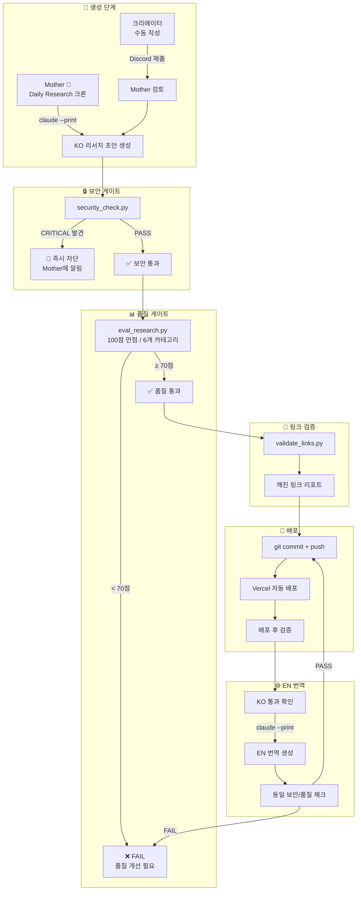

# HypeProof Research Pipeline — Security Architecture

> v1.0 | 2026-03-10 | Mother 관리

## Overview

모든 리서치 콘텐츠는 게시 전 **보안 게이트 → 품질 게이트 → 링크 검증** 3단계를 통과해야 한다.
Critical 보안 이슈 발견 시 점수와 무관하게 즉시 차단.

## Pipeline Flow



## 게이트 상세

### 1. 보안 게이트 (security_check.py)

| 검사 항목 | Severity | 조치 |
|-----------|----------|------|
| HTML Injection (`<script>`, `<iframe>`, etc.) | 🚨 Critical | 즉시 차단 |
| Event Handler (`onerror=`, `onclick=`, etc.) | 🚨 Critical | 즉시 차단 |
| JavaScript URI (`javascript:`, `data:text/html`) | 🚨 Critical | 즉시 차단 |
| Frontmatter Template Injection (`{{`, `}}`) | 🚨 Critical | 즉시 차단 |
| URL Shortener 과다 (3개+) | ⚠️ Warning | 검토 필요 |
| 의심 TLD (.tk, .ml, .ga, .cf) | ⚠️ Warning | 검토 필요 |
| 과도한 리다이렉트 (3회+, 도메인 변경) | ⚠️ Warning | 검토 필요 |
| HTML 주석 내 의심 코드 | ⚠️ Warning | 검토 필요 |
| 외부 트래커 이미지 | ℹ️ Info | 참고 |
| Zero-width 문자 | ℹ️ Info | 참고 |
| 일반 HTML 주석 | ℹ️ Info | 참고 |

### 2. 품질 게이트 (eval_research.py v1.1)

| 카테고리 | 배점 | 설명 |
|----------|------|------|
| Structure | 20 | frontmatter, H2 구조, Sources, 링크 수 |
| Style | 20 | 금지표현, 불릿 비율, 확신도 라벨 |
| Title Diversity | 15 | 클리셰, 최근 제목 중복 |
| Content Quality (LLM) | 25 | Hook, 스토리텔링, 비판, 연결성, So What |
| Links | 10 | 깨진 링크 검증 |
| **Security** | **10** | 보안 게이트 결과 통합 |
| **합계** | **100** | 70점 미만 = FAIL |

**Security 채점:**
- Critical → 0점 + **전체 FAIL 강제** (총점 무관)
- Warning → -3점/건
- Info → 감점 없음

### 3. 링크 검증 (validate_links.py)

- curl 기반 HTTP 상태 코드 확인
- paywall 도메인 자동 스킵
- 병렬 검증 (5 workers)

## 경로별 플로우

### 자동 생성 (Daily Research 크론)

```
Mother → 크론 트리거 → claude --print → KO 초안
  → security_check.py → eval_research.py → validate_links.py
  → git commit → Vercel
  → EN 번역 → 동일 체크 → git commit → Vercel
```

### 크리에이터 수동 제출

```
크리에이터 → Discord #submit 채널
  → Mother 검토 → 동일 파이프라인
  → 통과 시 게시 + 크리에이터에게 알림
  → 실패 시 피드백 + 수정 요청
```

## 운영 참고

- **Herald 미사용**: 현재 Mother가 전체 파이프라인 관리
- **보안 스캔 주기**: 매 게시 시 + 주 1회 전체 스캔 (--all)
- **결과 저장**: `research/eval-results/` 디렉토리
- **알림**: Critical 발견 시 Discord DM + 해당 채널 알림
